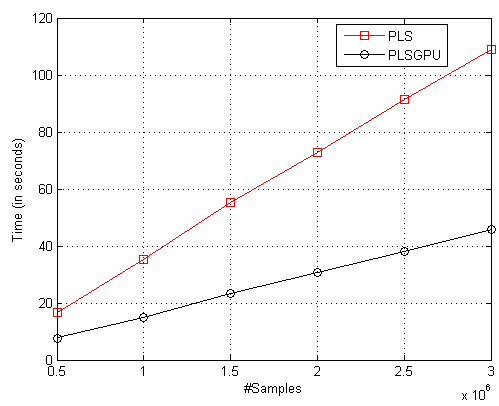

# PLSGPU
This repository provides a GPU implementation of the Partial Least Squares (PLS) algorithm. 

## Requirements

- [Scikit-learn](http://scikit-learn.org/stable/)
- [Keras](https://github.com/fchollet/keras)
- [Tensorflow](https://www.tensorflow.org/) 
- [Python 3](https://www.python.org/)

## Quick Start
[main.py](main.py) provides an example of usage of the PLS GPU. Currently, we do not implement the learning stage, therefore, you need to learn a PLS model using scikit-learn (which is performed in CPU).
By experiments, we note that for a small number of samples (for example., 100) the CPU version is slightly faster.
According to the figure, our GPU implementation of PLS achieves considerable speed-up compared to the CPU version.

## Parameters
Our PLSGPU takes two parameters:
1. A PLS model learnt from scikit-learn.
2. Batch size. This parameter controls the number of samples sent to GPU.
